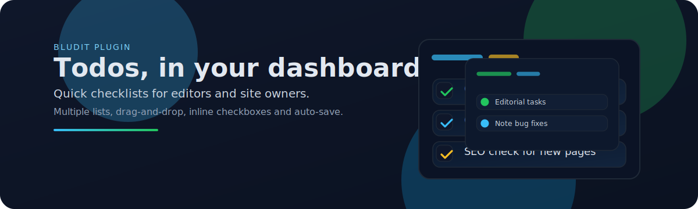
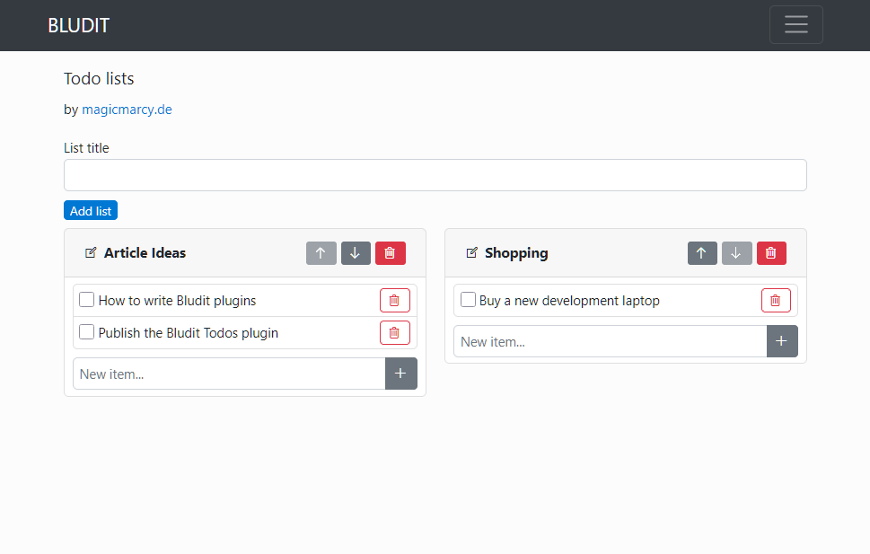
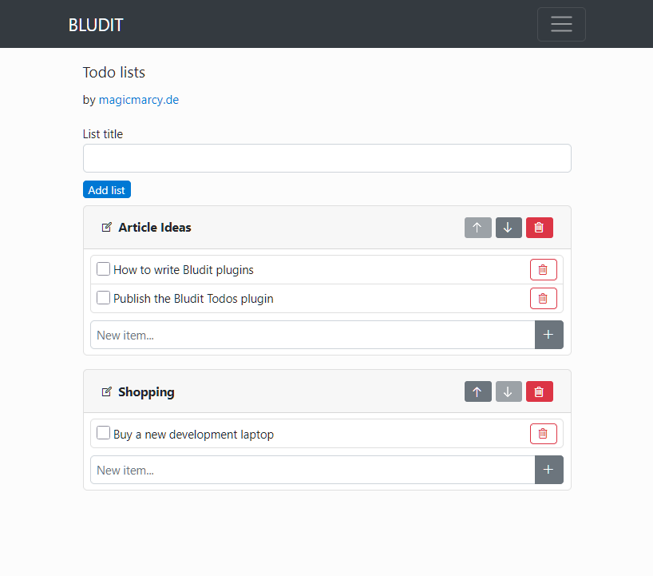
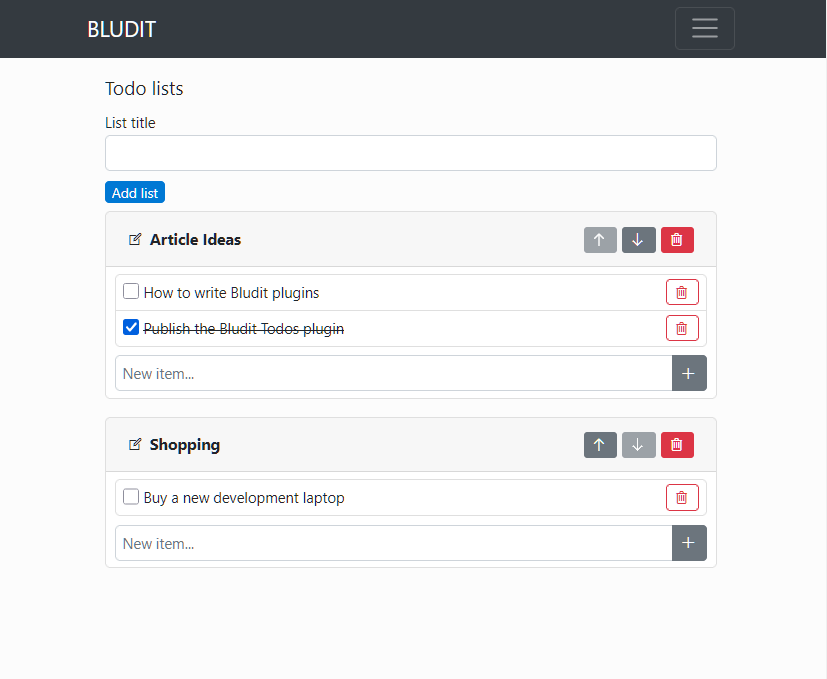

## Todos Plugin for Bludit

This plugin adds lightweight todo lists directly to the Bludit admin area. It is aimed at editors and site owners who need to track small tasks without leaving the dashboard.

### What you can do
- Create multiple todo lists with custom titles.
- Add, check off, and delete items inside each list.
- Reorder lists via drag and drop in the admin UI.
- Move lists up/down with buttons as an alternative to drag and drop.

### Installation
1) Copy the plugin folder into your Bludit `plugins` directory (or install through your usual plugin workflow).  
2) Enable the plugin in the Bludit admin.  
3) Open the plugin entry under `Plugins › Todos` to manage your lists.

### How it works
- The admin view renders from `views/dashboard.php` and loads assets from `css/todos.css` and `js/todos.js`.
- List/order changes use POST requests protected by Bludit’s CSRF token (carried in each form and the drag-and-drop fetch call).
- Data is stored as JSON in `todos.json` inside the plugin’s workspace directory.

### Tips
- Drag a list header to reorder lists; drop to persist the new order.
- Use the checkbox to toggle completion; the change submits automatically.
- Buttons beside each list let you move it up or down if drag is not convenient.

### Screenshots
Below are a few key states from the admin view to illustrate how the plugin behaves:

- Overall dashboard with multiple lists, compact layout, and drag handles on each card header.  
  
- Adding a new list through the inline form at the top of the dashboard.  
  
- Managing items inside a list: quick add field, inline toggle, and delete controls.  
  
- Reordering lists by dragging headers; the new order is saved automatically.  
  

### Support the project
If you enjoy this plugin and want to support its development, you can buy me a coffee on Ko‑fi: https://fo-fi.com/magicmarcy

### Compatibility and license
- Built for Bludit 3.x (see `metadata.json` for the declared target version).
- Licensed under the MIT License (see `LICENSE` and header in `plugin.php`).

### Repository layout
- `plugin.php` – plugin class, routing, data handling.
- `views/dashboard.php` – admin-facing HTML for managing todos.
- `css/todos.css` – compact admin styling.
- `js/todos.js` – drag-and-drop ordering and checkbox submit helpers.
- `todos.json` – data file created in the plugin workspace.

